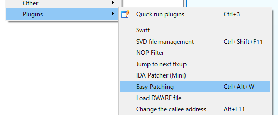

## Easy Patching

This is a simple plugin for Hex-Ray's IDA Pro disassembler to apply and save patches using `Ctrl+Alt+W`.

## Requirement

* IDA Pro 7.7

## Install

* Copy 'easy-patching.py' to IDA's plugins folder. The plugin will be automatically loaded the next time you start IDA Pro.

## Usage

* Select `'Edit'` -> `'Plugins'` -> `'Easy Patching'` or press `Ctrl+Alt+W`.
* `[ORIGINAL_NAME]-patched` file is saved.

 

## License

* MIT License

## Copyright

* Copyright (C) 2022 Hiroki Hada
* All rights reserved.

